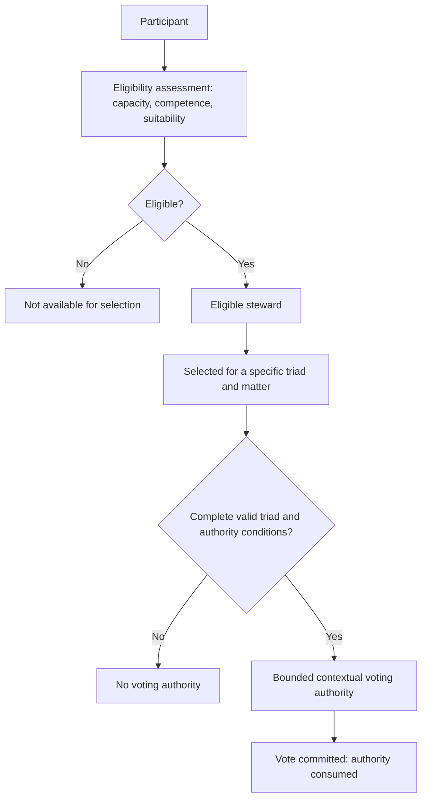

# Steward eligibility and contextual authority

Detailed admission and accreditation criteria remain subject to domain-specific verification; this diagram does not define them.

```mermaid
flowchart TD
 A[Participant] --> B[Eligibility assessment: capacity, competence, suitability]
 B --> C{Eligible?}
 C -->|No| D[Not available for selection]
 C -->|Yes| E[Eligible steward]
 E --> F[Selected for a specific triad and matter]
 F --> G{Complete valid triad and authority conditions?}
 G -->|No| H[No voting authority]
 G -->|Yes| I[Bounded contextual voting authority]
 I --> J[Vote committed: authority consumed]
```
