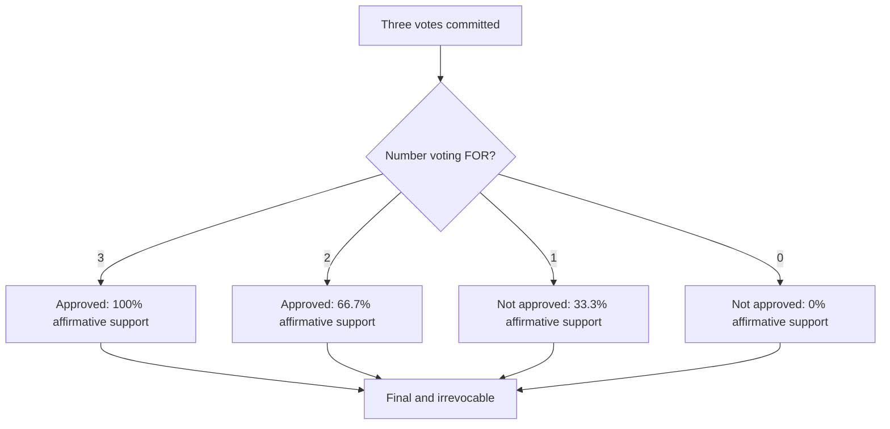

# Voting outcomes and confidence

```mermaid
flowchart TD
 A[Three votes committed] --> B{Number voting FOR?}
 B -->|3| C[Approved: 100% affirmative support]
 B -->|2| D[Approved: 66.7% affirmative support]
 B -->|1| E[Not approved: 33.3% affirmative support]
 B -->|0| F[Not approved: 0% affirmative support]
 C --> G[Final and irrevocable]
 D --> G
 E --> G
 F --> G
```
